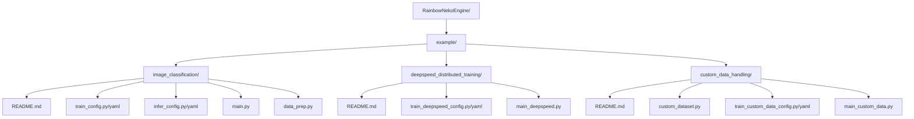

# RainbowNeko Engine Example 项目计划

本计划旨在为 `RainbowNekoEngine` 项目增加一个 `example` 文件夹，其中包含多个子项目，每个子项目都将展示 `RainbowNekoEngine` 库的特定功能，并附带一个 `README.md` 文件。

### 详细计划

我将在 `example` 文件夹中包含以下几个子项目，每个子项目都将有自己的独立结构和 `README.md` 文件：

1.  **`example/image_classification`**: 图像分类基础训练与推理示例
    *   **目的**: 展示 `RainbowNekoEngine` 进行标准图像分类任务的端到端流程，包括数据加载、模型训练和模型推理。
    *   **内容**:
        *   一个简单的图像分类模型（例如，基于 `torchvision` 的 `ResNet`）。
        *   训练配置文件（使用 Python 或 YAML 格式）。
        *   推理配置文件。
        *   一个用于训练和推理的 Python 脚本。
        *   `README.md` (中文) 详细说明如何运行、配置以及预期结果。
        *   一个用于下载或生成模拟数据集的脚本（或者说明如何准备数据）。
    *   **复杂度**: 中等。

2.  **`example/deepspeed_distributed_training`**: DeepSpeed 分布式训练示例
    *   **目的**: 展示如何利用 `RainbowNekoEngine` 集成 DeepSpeed 进行大规模模型的分布式训练，以减少显存占用和加速训练。
    *   **内容**:
        *   一个稍微复杂一些的模型或更大数据集的训练配置。
        *   DeepSpeed 相关的训练配置文件。
        *   一个用于 DeepSpeed 训练的 Python 脚本。
        *   `README.md` (中文) 详细说明 DeepSpeed 的配置、运行方式以及分布式训练的优势。
    *   **复杂度**: 中等偏高。

3.  **`example/custom_data_handling`**: 自定义数据处理示例
    *   **目的**: 展示 `RainbowNekoEngine` 中数据处理模块的灵活性，如何自定义数据源 (`data/source`) 或数据处理器 (`data/handler`)。
    *   **内容**:
        *   一个自定义的数据源或数据处理器实现。
        *   使用此自定义数据处理的简单训练配置。
        *   一个用于展示自定义数据处理的 Python 脚本。
        *   `README.md` (中文) 详细说明自定义数据处理的实现原理和使用方法。
    *   **复杂度**: 中等。

### 目录结构预览

### 实施步骤

1.  **创建 `example` 目录**: 在项目根目录下创建 `example` 文件夹。
2.  **创建子项目目录**: 在 `example` 目录下创建 `image_classification`、`deepspeed_distributed_training`、`custom_data_handling` 等子目录。
3.  **编写 `image_classification` 示例**:
    *   编写 `main.py` 包含训练和推理逻辑。
    *   创建 `train_config.py` (或 `.yaml`) 和 `infer_config.py` (或 `.yaml`)。
    *   编写 `data_prep.py` 用于生成或下载一个小型数据集（例如，CIFAR-10 的子集或模拟数据）。
    *   编写 `README.md`。
4.  **编写 `deepspeed_distributed_training` 示例**:
    *   编写 `main_deepspeed.py` 包含 DeepSpeed 训练逻辑。
    *   创建 `train_deepspeed_config.py` (或 `.yaml`)。
    *   编写 `README.md`。
5.  **编写 `custom_data_handling` 示例**:
    *   编写 `custom_dataset.py` 实现自定义数据源或处理逻辑。
    *   编写 `main_custom_data.py` 使用自定义数据处理进行简单训练。
    *   创建 `train_custom_data_config.py` (或 `.yaml`)。
    *   编写 `README.md`。
6.  **验证**: 确保所有示例都能独立运行并展示预期功能。